# Resumely iOS First-Time-User Journey Audit

**Audit date:** 2026-07-13
**Environment:** Freshly erased iPhone 17 Pro simulator, iOS 26.5, Debug build, live configured backend
**Method:** First-time-user walkthrough with a synthetic product-manager résumé and job description, followed by targeted implementation inspection. Observations, implementation evidence, and inferences are labeled separately.

## 1. Executive verdict

Resumely makes a strong first impression: the opening screen is focused, visually coherent, and promises a recruiter-style résumé check in under two minutes. Its clearest advantage is a guest-first, job-specific diagnosis before account creation, which gives users a reason to continue before asking for identity or payment. The first credible value arrives after choosing a résumé, pasting a job description, and running the free check. The journey then becomes repetitive: after signup, the user is asked to analyze again and then confirm the same job through another “Check Fit” action. Trust falls sharply when the result exposes a server placeholder, treats an employer name and generic verbs as missing keywords, recommends a title change that may overstate the candidate, and predicts a lower score after optimization. The most severe failure occurs after applying changes: the app lands on a blank screen while the optimized, design, and expert tabs remain locked, even though Account records a completed optimization. That prevents the audited user from reaching the product’s core deliverable—an optimized, previewable, exportable résumé. The proposition is monetizable in principle, but the current completion and credibility failures make a paywall premature.

## 2. First-time-user narrative

The opening feels calm and specific. “See your résumé like a recruiter does,” the three-step explanation, file constraints, and single primary action reduce uncertainty. The user can understand the promise without onboarding slides or an account wall.

Choosing a file is straightforward once the user reaches the correct Files location, although an empty Recents view can still feel like a dead end. After a résumé is selected, the product correctly shifts attention to the job input. The URL-or-description choice is useful, but the free-check button becomes available for any non-empty description even though the server later requires at least 100 words. The resulting “Server error (400)” makes a normal input mistake feel like a system failure.

The guest diagnosis is the journey’s emotional high point. A visible score, prioritized issues, quick wins, and a privacy explanation make the product feel useful before signup. That confidence is weakened immediately by malformed content such as `{targetTitle}` and later by implausible keyword gaps.

Signup itself is compact, but it offers only email and password in this configuration and provides no visible terms or privacy links at the commitment point. After signup, continuity breaks: the user must tap “Analyze my resume,” review the same job again, and tap “Check Fit.” This feels like the product did not remember the work it just performed.

The optimization review has the right interaction model—before/after explanations with per-change inclusion controls—but its evidence is unsafe. All changes begin selected, the projected score declines from 53% to 52%, a Product Manager is rewritten as a Senior Product Manager, and the education rewrite removes the graduation year. The user can reject a change, but cannot edit the generated wording or see a clear warning that the “optimized” result scores worse.

After Apply, the journey collapses. The screen becomes blank, output tabs remain locked, Account simultaneously claims one optimization at 52%, and the saved-résumé picker is empty after relaunch. The user has done the work and surrendered identity, but cannot reliably retrieve or export the promised result.

### Evidence walkthrough

#### Step 1 — Fresh Home

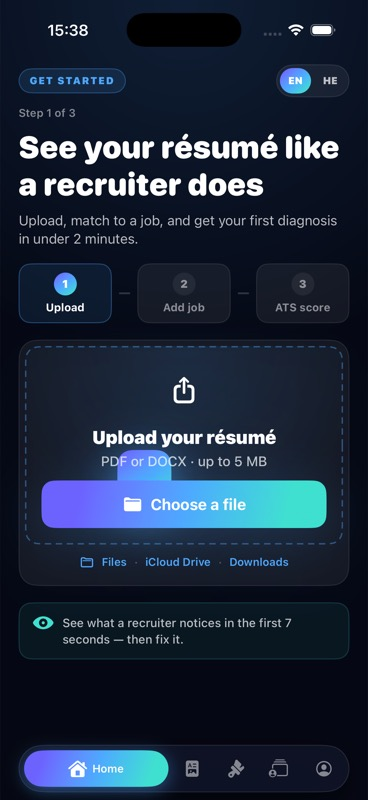

**General health: Good.** Clear promise, realistic time framing, visible file limits, and one primary CTA. The five-tab navigation previews depth but also exposes several destinations before they are useful.

#### Step 2 — Résumé selected and job requested

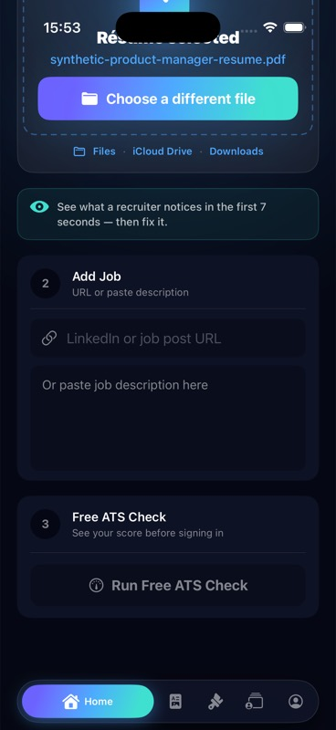

**General health: Good.** The selected filename confirms progress and the next task is obvious. URL and pasted-description paths accommodate different mobile workflows.

#### Step 3 — Job description ready

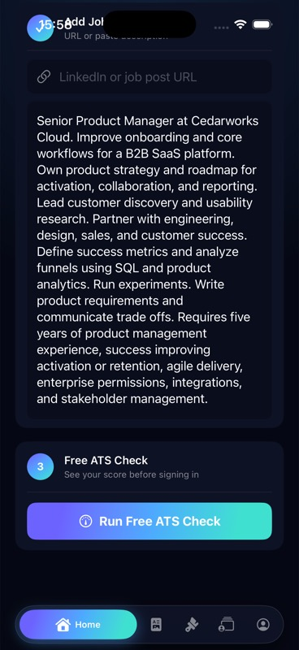

**General health: Mixed.** The CTA is prominent, but readiness is based only on non-empty input; no word-count guidance prepares the user for the backend requirement.

#### Step 4 — Server-side validation failure

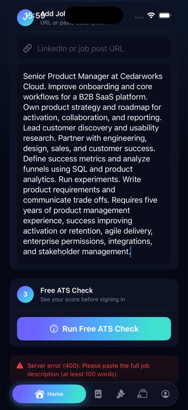

**General health: Poor.** A plausible but short description triggers technical “Server error (400)” copy and reveals the 100-word rule only after submission.

#### Step 5 — Analysis processing

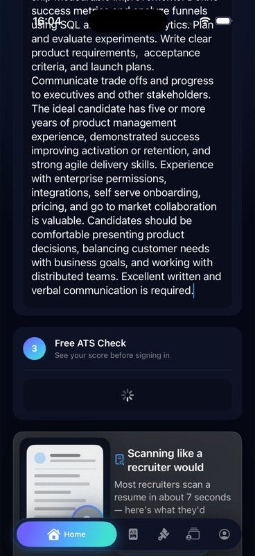

**General health: Good.** “Scanning like a recruiter would” sustains the product promise and provides a clear progress state.

#### Step 6 — First diagnosis and score

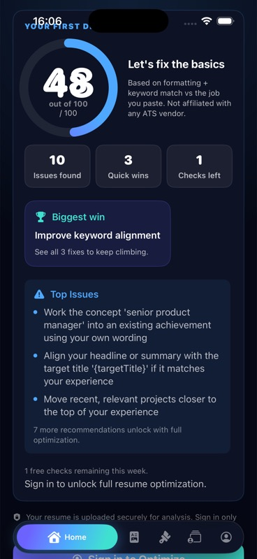

**General health: Mixed.** The guest gets meaningful-looking value before signup, but duplicated score labeling and a visible `{targetTitle}` placeholder damage credibility.

#### Step 7 — Sign-in gate after value

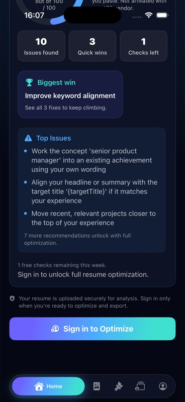

**General health: Good.** The gate follows demonstrated value, explains privacy, and preserves a sense of progress. Locked recommendation count helps motivate continuation.

#### Step 8 — Account creation

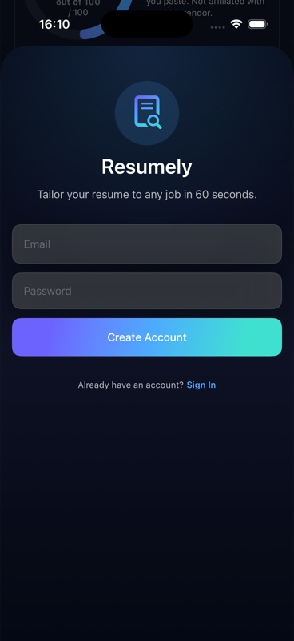

**General health: Mixed.** The form is short, but lacks Apple sign-in and visible terms/privacy links; placeholder-only fields are also weaker for accessibility and error recovery.

#### Step 9 — Analyze again after signup

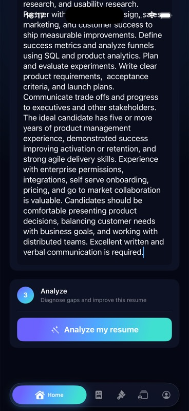

**General health: Poor.** The résumé and job remain visible, but the user is asked to repeat the analysis action immediately after receiving a guest diagnosis.

#### Step 10 — Redundant fit confirmation

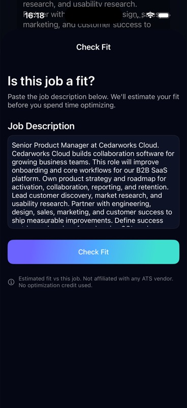

**General health: Poor.** The same job description is presented again and requires another “Check Fit” tap before optimization can begin.

#### Step 11 — Fit result and keyword credibility risk

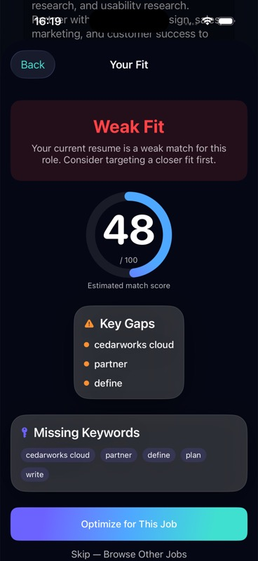

**General health: Poor.** A precise 48 score is paired with gaps such as the fictional employer name and generic words (“partner,” “define,” “plan,” “write”), making the model feel like literal token matching rather than recruiter judgment.

#### Step 12 — Optimization review predicts regression

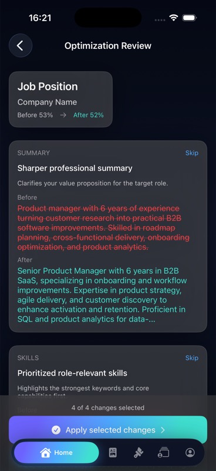

**General health: Poor.** Before/after review and selection controls are strong, but all changes default on and the promised result declines from 53% to 52%. The proposed “Senior Product Manager” title risks factual inflation.

#### Step 13 — Education change removes evidence

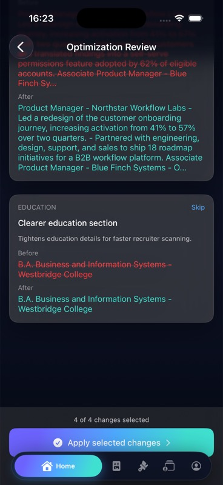

**General health: Poor.** The generated “improvement” removes the graduation year and begins selected. The Skip control provides some user agency.

#### Step 14 — Blank screen after Apply

**General health: Critical.** Apply produces neither confirmation nor output—only a blank Optimization Review destination and navigation chrome.

#### Step 15 — Optimized tab remains locked

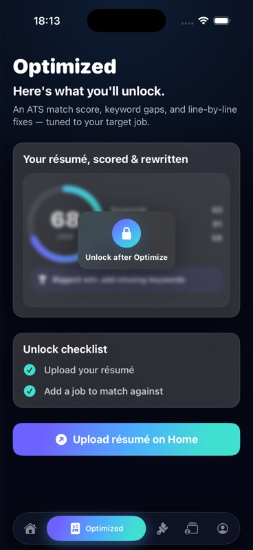

**General health: Critical.** The app asks the user to upload on Home even though upload and job steps are checked and optimization was just applied.

#### Step 16 — Design remains locked

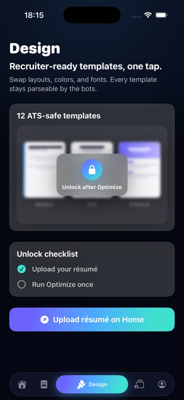

**General health: Poor.** The tab advertises 12 ATS-safe templates but cannot recognize the completed optimization or provide a truthful recovery action.

#### Step 17 — Expert remains locked

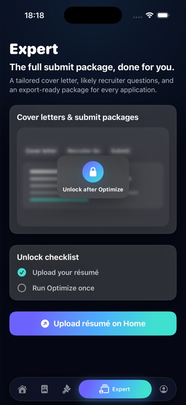

**General health: Poor.** Another locked destination repeats the same stale checklist and upload CTA, increasing the feeling that work was lost.

#### Step 18 — Account contradicts locked state

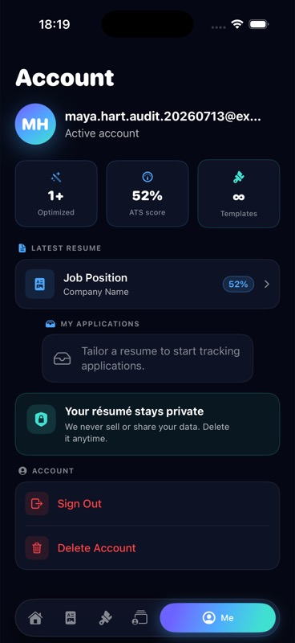

**General health: Critical.** Account shows “1+ Optimized” and a 52% latest résumé while the product tabs say no optimization exists. This proves the backend work exists but the main experience cannot recover it.

#### Step 19 — Saved résumés are empty after optimization

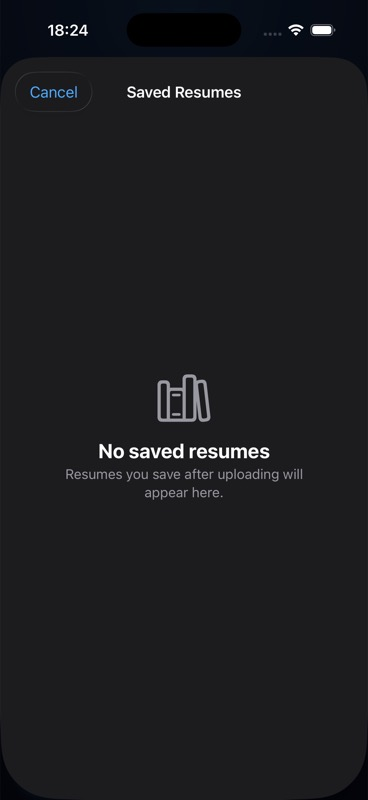

**General health: Poor.** Relaunch offers “Use a saved resume,” but the library is empty and no save confirmation was observed during the completed flow.

#### Step 20 — Hebrew Home has mixed-language content

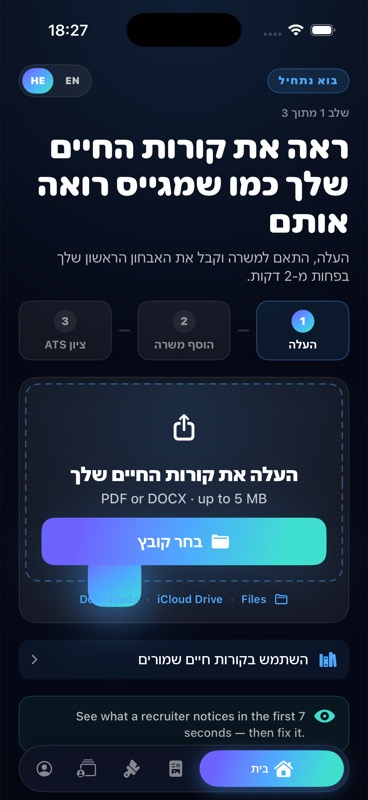

**General health: Mixed.** Core layout and navigation mirror correctly in RTL, but English fragments remain in the recruiter callout and file-location guidance, making localization feel unfinished.

## 3. Journey map

| Stage | User goal | Product response | Emotion | Friction | Outcome |
|---|---|---|---|---|---|
| Launch | Understand what the app does | Recruiter-style score, three steps, under-two-minute promise | Curious, reassured | Advanced tabs visible before relevance | Continues |
| Resume input | Provide existing résumé | Opens Files directly; confirms filename | Confident if file is findable | Empty Recents may appear empty; no create-from-scratch route | Continues |
| Job input | Provide target role | Accepts URL or pasted description | In control | No minimum-length cue | Submits too early |
| Free check | Get quick insight | Processing state, then score/issues/quick wins | Rewarded | Technical 400 on short input; malformed placeholder | Sees initial value |
| Account | Unlock recommendations | Email/password signup after value | Willing but cautious | No Apple option or legal links in view | Creates account |
| Authenticated analysis | Continue where left off | Requires Analyze, then Check Fit | Confused, impatient | Same inputs and intent repeated | Continues with effort |
| Fit verdict | Decide whether to optimize | Score, gaps, missing keywords | Concerned | Weak evidence and literal keywords reduce trust | Proceeds experimentally |
| Review | Approve AI changes | Before/after groups, default-all selected | Initially empowered, then alarmed | Score regression, title inflation, information removal, no inline editing | Rejects one change, applies rest |
| Completion | Access optimized résumé | Blank page; locked output tabs | Betrayed | No confirmation or recovery | Core journey fails |
| Return | Find prior work | Account sees history; saved library empty | Confused | Contradictory sources of truth | Retention motivation collapses |

## 4. Top 10 abandonment risks

| # | Severity | Risk | Evidence | Likely user response |
|---|---|---|---|---|
| 1 | Critical | Apply does not lead to usable output | Observed blank page after Apply; Optimized remains locked | Assume work was lost; quit before export |
| 2 | Critical | Product state contradicts itself | Account shows 1+ optimized/52%, other tabs say optimization is locked | Stop trusting persistence and completion |
| 3 | High | Score and keyword logic appears unreliable | Employer name and generic verbs presented as key gaps | Dismiss the analysis as shallow keyword matching |
| 4 | High | “Optimization” predicts a lower score | Review shows 53% before and 52% after | Refuse changes or abandon the product promise |
| 5 | High | AI can alter factual seniority | Product Manager rewritten as Senior Product Manager | Fear résumé dishonesty and reputational harm |
| 6 | High | Repeated post-signup work | Analyze again, then Check Fit, using the same résumé/job | Feel progress was reset by signup |
| 7 | Medium–High | Input rules appear only as a server failure | Short job description produces “Server error (400)” and late 100-word rule | Blame app stability instead of correcting input |
| 8 | Medium–High | Generated issues expose raw placeholders | `{targetTitle}` appears in the first diagnosis | Question whether any advice was reviewed or personalized |
| 9 | Medium | Saved-work expectation is unmet | “Use a saved resume” opens an empty library after completed optimization | Avoid returning because retrieval seems unreliable |
| 10 | Medium | Mobile file selection can start empty | System picker opens on empty Recents; location cues exist but are secondary | Assume the app cannot access their résumé |

## 5. Activation analysis

### Intended activation

The implementation and UI imply a ladder:

1. Select a résumé.
2. Add a target job.
3. Receive a free ATS-style diagnosis.
4. Create an account.
5. Check fit.
6. Review and apply changes.
7. View/export the optimized résumé.

The current analytics treats `optimization_completed` as the canonical activation event. That is a useful operational milestone, but in this walkthrough it fired conceptually before the user could consume the result. Backend completion is therefore not equivalent to user activation.

### Actual activation

The earliest credible value is the guest diagnosis: it arrives before signup and shows a score, issue count, quick wins, and prioritized advice. It requires three meaningful user contributions—résumé, job context, submit—plus file-picker navigation. That is a reasonable amount of effort for tailored value.

The strongest activation definition should be **first optimized résumé successfully viewed**, with a guardrail that at least one recommended change was knowingly accepted or edited. `optimization_completed` should remain a processing milestone; `optimized_viewed` should become the user-value milestone. Export is a deeper activation/retention signal, not the first moment of value.

### What to remove or delay

- Remove the second Analyze action after signup; carry the guest result and inputs forward.
- Remove the separate Check Fit confirmation when the same job was just analyzed; show fit as part of the diagnosis or run it automatically.
- Delay exposing locked Design and Expert tabs until a usable optimized résumé exists, or make them educational previews without false completion checklists.
- Ask to save after the optimized preview is visibly available—not during a fragile navigation transition.

### Motivation to continue

The best motivators are already present: a partial diagnosis, a count of locked recommendations, and selective before/after changes. They will work only if the output is credible. A “three fixes could move you from X to Y” preview should be shown only when the projected result improves and every claim is traceable to the job description.

## 6. Trust analysis

### ATS and score trust

The app appropriately states that the score is an estimate and is not affiliated with ATS vendors. However, precision (“48,” “52%”) implies measurement confidence that the evidence does not support. Duplicate score labels and an after-score below the before-score compound the problem. Rename the metric to a Resumely Job Match estimate, explain the factors, and show confidence or evidence rather than presenting it as a universal ATS truth.

### AI recommendation trust

Before/after presentation and per-change controls are strong foundations. Trust breaks when generated content changes seniority, removes a date, or defaults every proposal on. Factual fields should be protected, changes should default to review rather than blanket inclusion, and each recommendation should cite the exact job requirement it addresses. Users also need Edit and Undo, not just Include/Skip.

### Privacy trust

The guest diagnosis includes reassuring privacy language, and Account provides privacy/delete controls. The account-creation moment should repeat the essentials and link to Privacy and Terms. The product should plainly state what is uploaded, whether résumé/job content is retained, and how to delete it.

### Accuracy and credibility

Raw placeholders and employer-name “keywords” are release-blocking content-quality defects because the entire product is an advice engine. Generic marketing language such as “like a recruiter” should be supported by transparent evidence: matched requirement, source sentence, proposed change, and expected impact.

### Export confidence

Export could not be evaluated as a user because the post-Apply state blocked access. Code inspection shows a Preview & Export PDF path and a local fallback, but that is not user evidence. Until a fresh user can preview, export, share, relaunch, and recover the same document, export confidence is effectively absent.

### Payment trust

No live paywall or purchase flow appeared, and implementation configuration has monetization disabled. The current scaffold must not be treated as a validated monetization experience. Payment should remain off until completion, recovery, and recommendation credibility are reliable.

## 7. What is working well

- The opening screen explains the benefit and required inputs without onboarding theater.
- Guest-first diagnosis demonstrates value before account creation.
- Job URL or pasted description supports real mobile job-search behavior.
- Loading language reinforces the recruiter-oriented promise.
- The diagnosis is structured around issues and quick wins rather than an unexplained score alone.
- The privacy note and ATS-vendor disclaimer show healthy instincts.
- Before/after review with per-group controls is the right product pattern.
- Dark-mode visual hierarchy is generally coherent, with large primary actions and recognizable tab labels.
- RTL mirroring works across the primary structure.
- Account deletion is discoverable.

## 8. What is weak or missing

### Positioning

The home promise is strong, but the product oscillates among “ATS score,” recruiter judgment, job fit, résumé optimization, templates, and expert package. The first session should make one promise: improve this résumé for this job without inventing facts.

### Onboarding

Skipping onboarding is a strength, but the product needs contextual guidance at risk points: where to find a file, how much job text is required, what the score means, and what happens to uploaded data.

### Résumé input

The observed first-time route is import-only. There is no visible manual résumé creation, profile/work-history/education/skills builder, sample résumé, or paste-text fallback. This narrows the addressable first-time audience and makes Files availability a hard dependency.

### Job input

Client and server validation are inconsistent: Home enables submission on non-empty text, the guest endpoint requires at least 100 words, and the fit implementation checks a different threshold. Show one shared rule, live word count, and examples of acceptable content.

### ATS diagnosis

The score presentation is too precise, duplicates labels, and exposes malformed server content. Recommendations need traceable evidence and quality gates before display.

### AI changes

All groups default selected; there is no inline editing or undo; and factual/regressive changes are not blocked. The system should never present a lower projected score as an improvement without an explicit explanation.

### Mobile usability and accessibility

Primary targets are generally large, but the flow relies on long scrolling screens and small secondary text. Signup uses placeholder-only labels. Mixed Hebrew/English reduces comprehension. VoiceOver order, Dynamic Type extremes, contrast ratios, keyboard avoidance, and physical-device ergonomics were not instrumentally verified in this audit.

### Templates and design

Templates are advertised but unreachable in the observed journey. The locked tab provides no real preview, comparison, or explanation of how design affects ATS safety.

### Export

The core export deliverable is blocked after Apply. No first-time confirmation, preview, share, save, or recovery was successfully observed.

### Monetization

Monetization is disabled, which is appropriate at the current quality level. The existing credit scaffold does not yet communicate value boundaries, refund expectations, restoration, or what is free versus paid in a completed user journey.

### Retention

The app does not reliably demonstrate saved work after the first optimization. No return hook, next-job shortcut, progress history, or clear “optimize another job using this résumé” loop was reached. Notification permission was not requested, which is appropriate until a credible notification use case exists.

## 9. What to double down on

Double down on the **job-specific, guest-first insight loop**:

- Preserve the no-signup first diagnosis.
- Make every issue traceable to an exact job requirement and résumé passage.
- Turn quick wins into a small number of high-confidence, fact-safe changes.
- Keep before/after review and per-change control, adding edit and undo.
- Carry the résumé, job, diagnosis, and user choices continuously through signup.
- After success, make “try another job with this résumé” the primary retention loop.

This is more differentiated than a generic résumé builder or template gallery and better aligned with the existing product architecture.

## 10. What to simplify

Collapse the first session into one continuous path:

**Choose résumé → Add job → See guest diagnosis → Create account to apply fixes → Review/edit changes → Preview optimized résumé → Save/export.**

Do not ask the user to Analyze and then Check Fit again. Fit should be an explanatory section inside the diagnosis, not a second gateway. Keep Design and Expert out of the critical path until the optimized preview is available. Use one completion source of truth so Home, Optimized, Design, Expert, Account, and Saved Résumés cannot disagree.

## 11. Bugs and broken states

### B1 — Blank screen after applying optimization

- **Severity:** Critical
- **Reproduction:** Fresh flow → guest check → signup → Analyze → Check Fit → Optimize → review changes → Apply.
- **Expected:** Confirmation followed by optimized résumé preview.
- **Actual:** Blank Optimization Review page with only navigation chrome.
- **Likely cause (implementation inference):** Home dismisses the review navigation destination and enables a second diagnosis destination in the same completion callback, creating a fragile competing-navigation state transition.

### B2 — Completed optimization does not unlock product tabs

- **Severity:** Critical
- **Reproduction:** Complete B1, then open Optimized, Design, and Expert.
- **Expected:** Tabs recognize the new optimization or offer recovery from its ID.
- **Actual:** All remain locked and direct the user to upload again.
- **Implementation evidence:** These tabs gate on `AppState.latestOptimizationId`; Account loads optimization history independently from the backend and therefore shows the completed result even when app state is missing.

### B3 — Saved résumé library is empty after completion

- **Severity:** High
- **Reproduction:** Complete optimization, relaunch, tap “Use a saved resume.”
- **Expected:** Recently processed résumé is available or the prior flow clearly asked whether to save it.
- **Actual:** Empty-state message; no save prompt was observed.
- **Likely cause (implementation inference):** Save confirmation is triggered during the same unstable post-review navigation transition and may never become visible.

### B4 — Guest job validation uses technical server error

- **Severity:** High
- **Reproduction:** Paste a plausible job description below 100 words and run free check.
- **Expected:** Inline word-count guidance before submission.
- **Actual:** Network request followed by “Server error (400): Please paste the full job description (at least 100 words).”
- **Implementation evidence:** Home readiness checks only for non-empty input; public ATS validation happens server-side. Fit uses another local threshold.

### B5 — Raw placeholder appears in diagnosis

- **Severity:** High
- **Reproduction:** Run guest diagnosis with the audit fixture.
- **Expected:** Fully rendered, user-specific issue text.
- **Actual:** `{targetTitle}` is displayed.

### B6 — Score label is rendered twice

- **Severity:** Medium
- **Reproduction:** Open first diagnosis.
- **Expected:** One accessible score label.
- **Actual:** Visually duplicated score/out-of-100 text.
- **Implementation evidence:** The score ring already renders its label and the result screen overlays a second label.

### B7 — Optimization can predict a lower score

- **Severity:** High
- **Reproduction:** Open optimization review for the audit fixture.
- **Expected:** Regressive output is blocked, recalculated, or explicitly explained.
- **Actual:** 53% before → 52% after while Apply remains the primary action.

### B8 — Generated change removes education date and inflates title

- **Severity:** High trust/safety risk
- **Reproduction:** Review all generated groups.
- **Expected:** Fact-preserving edits with explicit confirmation for factual fields.
- **Actual:** Education year is removed; current title is upgraded to “Senior Product Manager.” Both begin selected.

### B9 — Hebrew localization is incomplete

- **Severity:** Medium
- **Reproduction:** Switch Home to Hebrew.
- **Expected:** Complete RTL localization except unavoidable file-format names.
- **Actual:** English recruiter callout and file-location strings remain.

## 12. Instrumentation gaps

### Existing useful events

The implementation already covers launch/guest entry, upload CTA exposure and picker states, file selection/upload results, job added, free ATS completion, auth completion, fit-check lifecycle, optimization start/completion, diagnosis/optimized views, and export start/success/failure. Upload-event semantics should be cleaned up: `resume_uploaded` is emitted on local file selection and again after authenticated server upload, which can inflate funnel interpretation.

### Events or properties to add

| Event | Why it matters | Minimum properties |
|---|---|---|
| `free_ats_started` / `free_ats_failed` | Separate intent, network failure, and validation loss | input type, word count bucket, error category, HTTP status |
| `job_input_validation_shown` | Measure preventable input friction | rule, current word count, surface |
| `signup_gate_viewed` / `signup_started` / `signup_failed` | Diagnose value-to-account conversion | source, auth method, error category |
| `continuation_reprompt_viewed` | Quantify repeated Analyze/Check Fit friction | prompt type, previous completed stage |
| `recommendation_viewed` | Understand which advice is consumed | group type, rank, evidence available |
| `recommendation_included` / `skipped` / `edited` | Measure trust and control | group type, score delta, factual-field flag |
| `optimization_apply_started` / `apply_failed` | Isolate the observed completion break | review id, included count, error/navigation state |
| `optimized_preview_rendered` | Canonical user activation | optimization id, render duration, source |
| `saved_resume_prompt_viewed` / `save_success` / `save_failed` | Validate persistence and return readiness | optimization id, source, error category |
| `locked_tab_viewed` | Detect contradiction after completion | tab, latest ID present, backend history count |
| `template_previewed` / `template_selected` | Measure design interest before monetization | template id, free/paid, optimization id |
| `paywall_viewed` / `purchase_started` / `purchase_success` / `purchase_failed` / `restore_result` | Required before evaluating monetization | entry point, product id, result, error category |
| `second_job_started` / `second_optimization_completed` | Measure core retention loop | days since first value, reused resume |

Recommended funnel: `app_launched → resume_file_selected → job_added → free_ats_completed → signup_completed → optimization_completed → optimized_preview_rendered → export_success`, with separate error and re-prompt branches. Report founder/QA/internal users separately from real users and use a single semantic definition per event.

## 13. Monetization recommendation

Do not turn on the paywall yet. First establish that a new user can reach a credible optimized preview, recover it after relaunch, and export it successfully. Then monetize at a clear value boundary: keep the initial diagnosis and a limited evidence-backed preview free; charge when the user chooses to apply high-confidence changes, unlock additional job-specific versions/templates, or export a polished package. Avoid charging for access to a score alone. Before release, the paywall needs plain-language entitlements, restoration, failure recovery, legal links, and proof that the underlying suggestions preserve facts.

## 14. Prioritized recommendations

### P0 — Restore completion and trust

1. Replace the competing post-Apply destinations with one deterministic route to optimized preview.
2. Use one persisted completion source of truth across every tab and Account; recover from backend history when local state is absent.
3. Add content-quality gates: reject raw placeholders, factual title inflation, removed dates, and any unexplained non-positive score delta.
4. Add local, shared job-description validation with friendly inline copy and a live word count.
5. Verify the complete fresh-user path through preview, save, PDF export/share, relaunch, and recovery on simulator and physical device.

### P1 — Remove repetition and increase agency

1. Carry the guest diagnosis through signup; automatically reuse the résumé and job.
2. Merge fit into diagnosis instead of requiring a second check.
3. Default risky/factual change groups off; add Edit and Undo.
4. Cite the job requirement and résumé evidence behind every recommendation.
5. Make save status explicit and show recent work immediately after completion.

### P2 — Improve reach and polish

1. Add a paste-text or guided create path for users without a résumé file in Files.
2. Complete Hebrew localization and test Dynamic Type, VoiceOver, contrast, keyboard behavior, and smaller devices.
3. Preview templates without forcing them into the activation path.
4. Add a one-tap “optimize for another job” return loop.
5. Validate monetization only after trustworthy completion metrics exist.

## 15. Three high-impact experiments

### Experiment 1 — Insight before full résumé completion

**Hypothesis:** Users without a ready file will engage if they can paste a target job and one recent-role summary to receive a limited “top three job requirements” insight before building or uploading a full résumé.
**Variant:** Add “No résumé file? Start with your latest role” beneath the file CTA; show requirements and a completeness meter, then request the full résumé for personalized rewrites.
**Primary metric:** Start-to-resume-provided conversion.
**Guardrail:** Do not show a precise personal score before sufficient résumé evidence exists.

### Experiment 2 — Continuous post-signup handoff

**Hypothesis:** Removing repeated Analyze and Check Fit actions will materially improve signup-to-review conversion.
**Control:** Current signup → Analyze → Check Fit → Optimize path.
**Variant:** Signup returns directly to the preserved diagnosis, automatically prepares fit, and opens review with one “Review fixes” action.
**Primary metric:** Signup completed → optimization review viewed.
**Guardrails:** Error rate, processing time, and recommendation-quality rejection rate.

### Experiment 3 — Evidence-backed original versus improved review

**Hypothesis:** Showing the original text, improved text, exact job requirement, and a fact-preservation badge will increase accepted changes without reducing trust.
**Control:** Current Before/After card.
**Variant:** Four-part card: job evidence → original → improved → “facts preserved,” with Edit, Accept, and Skip; default factual fields to manual approval.
**Primary metric:** Deliberate acceptance or edit rate per viewed recommendation.
**Guardrails:** Undo rate, post-export correction rate, and reported factual errors.

## 16. Final scorecard

| Dimension | Score | Reason |
|---|---:|---|
| First impression | 8/10 | Focused, polished, and immediately understandable |
| Promise clarity | 8/10 | Recruiter-style, job-specific check is clear; ATS/fit/optimize terminology later fragments it |
| Onboarding clarity | 6/10 | Excellent absence of ceremony, but weak guidance at validation, auth, and continuity points |
| Résumé input | 6/10 | Direct import and good file cues; empty Recents and no non-file route remain barriers |
| Time to first value | 7/10 | Guest diagnosis arrives early with reasonable effort; avoidable validation delays it |
| Job-match credibility | 3/10 | Precise score, poor keyword gaps, and placeholder output undermine belief |
| AI recommendation quality | 4/10 | Useful review structure, but regressive and fact-risky changes are unacceptable |
| User control | 6/10 | Include/Skip exists per group; defaults, editing, and undo need improvement |
| Mobile usability | 6/10 | Strong primary hierarchy; long screens, file dependency, and localization/accessibility gaps |
| Export confidence | 1/10 | Core output and export were unreachable after a completed Apply |
| Monetization readiness | 2/10 | Value proposition is chargeable, but completion and trust are not ready |
| Retention motivation | 3/10 | Another-job loop is promising, but saved/recoverable work failed in the observed flow |
| **Overall first-time journey** | **4/10** | Strong acquisition surface and early value, followed by severe credibility and completion failures |

## Evidence limits

- This is one fresh-install, one-account walkthrough using synthetic content on an iPhone 17 Pro simulator and the live configured backend.
- No real personal résumé, purchase, or external submission was used.
- Export, template selection, design customization, expert package, and paywall behavior could not be evaluated as completed user flows because the post-Apply state blocked them; implementation inspection is not presented as user evidence.
- Accessibility observations are heuristic. VoiceOver traversal, Dynamic Type extremes, measured contrast, keyboard/switch control, and physical-device testing remain required.
- Time-to-value was evaluated by interaction count and observed waiting states, not as a controlled performance benchmark.
- Backend recommendation quality may vary by fixture and model run; the captured defects are still release-relevant because they were shown without safety filtering.
