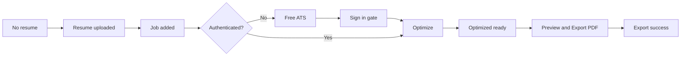

# Feature Spec — Resumely Pre-Submission UX/UI Transformation

**Date:** 2026-05-31
**Status:** Approved
**Branch:** `cursor/resumely-pre-submission-ux-cb5f`

---

## Objective

Deliver a guest-first activation funnel so first-time users clearly progress from resume upload → job input → free ATS → sign-in → optimization → preview/export → export success, with honest account states and export-first Optimized tab UX.

## User Story

As a first-time job seeker, I want to upload my resume and try a free ATS check without signing in, then sign in only when I'm ready to optimize and export, so that I understand the product value before creating an account.

## Guest Model

| State | Who | What they see |
|-------|-----|---------------|
| Guest | No `AppState.session` | Full Home tab (upload, job, free ATS); Me shows "Guest mode" + Sign In CTA; no fake "Signed in" |
| Authenticated | Valid `AuthSession` | Real email, Sign Out, optimization + export; applications load when token present |

Guests may run `runPublicATSCheck` without auth. Optimization and PDF export require sign-in. Anonymous ATS session converts on sign-in via existing `convertAnonymousSessionIfNeeded()`.

## Activation Funnel

### HomeActivationState (derived)

| State | Conditions |
|-------|------------|
| `noResume` | No selected resume |
| `resumeNoJob` | Resume selected, no job URL or description |
| `readyForFreeATS` | Resume + job, guest, not optimizing, no ATS result yet |
| `readyToOptimize` | Resume + job, authenticated, not optimizing, no optimization id for current flow |
| `atsComplete` | Guest with `atsResult` present |
| `optimizing` | `isOptimizing` or `isRunningFreeATS` |
| `optimizedReady` | `appState.latestOptimizationId` set, export not completed for that id |
| `exportComplete` | Export completed for current `latestOptimizationId` |

## UI Principles

1. **Home, not Tailor** — First tab label is "Home"; internal enum stays `ResumlyTab.tailor` to reduce churn.
2. **Export-first Optimized** — Primary CTA: "Preview & Export PDF"; secondary group: Refine, Design, Expert.
3. **Honest account** — Me tab never shows "Signed in" / "Active account" for guests.
4. **Locked advanced tabs** — Design and Expert show intentional empty states with "Go to Home" until `latestOptimizationId` exists.
5. **No dead library UI** — Hide saved-resume affordances when `RuntimeFeatures.isResumeLibraryEnabled == false`.
6. **Accessibility** — Tab bar items expose label + value for VoiceOver (Home, Optimized, Design, Expert, Me).

## Acceptance Criteria

- [ ] Spec exists at `docs/specs/resumely-pre-submission-ux-ui-transformation.md`
- [ ] First tab displays "Home" label; activation states drive hero copy and step emphasis
- [ ] Guest Me tab: "Guest mode", privacy reassurance, Sign In CTA; no Sign Out
- [ ] Authenticated Me tab: real email, Sign Out; no guest copy
- [ ] Optimized tab: primary export CTA, secondary improve actions, export success state
- [ ] Design + Expert tabs locked pre-optimization with "Go to Home"
- [ ] Resume library UI hidden when feature flag is false
- [ ] Tab accessibility labels/values on all five tabs
- [ ] `AnalyticsService` tracks 11 events; no resume/job/email/name in properties
- [ ] Analytics no-op when `POSTHOG_API_KEY` absent
- [ ] Export completion persisted by optimization id + date (not temp file URL)
- [ ] Unit tests: activation derivation, analytics request construction, guest/auth labels
- [ ] Xcode build succeeds; test suite passes

## QA Matrix

| Scenario | Device | Expected |
|----------|--------|----------|
| Cold guest launch | iPhone 17 / SE | Home no-resume state; Me guest mode |
| Upload resume | Either | Step 1 checkmark; prompt job |
| Add job (guest) | Either | Free ATS CTA enabled |
| Free ATS complete | Either | Score shown; Sign in to Optimize |
| Sign-in gate | Either | Onboarding sheet; Me updates after auth |
| Optimize (auth) | Either | Switches to Optimized tab |
| Export PDF | Either | Share sheet; success actions; analytics |
| Design locked | Either | Empty state → Go to Home |
| Expert locked | Either | Empty state → Go to Home |
| PostHog | Live or log | 11 events fire without PII properties |

## API Changes

None. Uses existing upload, public ATS, optimize, and download endpoints.

## iOS Changes

### New Files

| File | Purpose |
|------|---------|
| `Features/V2/Home/HomeActivationState.swift` | Pure activation state derivation |
| `Features/V2/Home/HomeTabView.swift` | V2 Home activation surface (wraps TailorViewModel) |
| `Core/Analytics/AnalyticsService.swift` | URLSession PostHog transport + typed events |
| `Core/Export/ResumeExportAction.swift` | Shared export action for Optimized tab |
| `ResumeBuilder IOS APPTests/HomeActivationStateTests.swift` | Activation derivation tests |
| `ResumeBuilder IOS APPTests/AnalyticsServiceTests.swift` | Analytics construction + PII guard tests |
| `ResumeBuilder IOS APPTests/ProfileAccountDisplayTests.swift` | Guest vs auth display logic |

### Modified Files

| File | Change |
|------|--------|
| `ResumlyTabBar.swift` | Home label, accessibility |
| `MainTabViewV2.swift` | HomeTabView, Design lock wrapper |
| `AppState.swift` | Export completion persistence |
| `ProfileView.swift` | Guest vs authenticated account truth |
| `OptimizedResumeView.swift` | Export-first layout + success |
| `OptimizedResumeTabView.swift` | Go to Home copy |
| `ExpertTabView.swift` | Go to Home copy |
| `BackendConfig.swift` | PostHog config readers |
| `ResumeBuilder_IOS_APPApp.swift` | `app_launched` + `guest_mode_started` |
| `TailorViewModel.swift` | Analytics hooks (via caller) |
| `docs/qa/ios-qa-checklist.md` | Home/Optimized/Design/Expert/Me tabs |

## Analytics Events

| Event | Trigger | Safe properties |
|-------|---------|-----------------|
| `app_launched` | App bootstrap complete | `is_authenticated` |
| `guest_mode_started` | Guest session after bootstrap | — |
| `resume_uploaded` | PDF preflight success | — |
| `job_added` | Job URL or description non-empty | `has_url`, `has_paste` |
| `free_ats_completed` | Public ATS success | `score_bucket` (0-40/41-60/61-80/81-100) |
| `sign_in_completed` | Session set after auth | — |
| `optimization_started` | Optimize begins (auth) | — |
| `optimization_completed` | Optimization id set | — |
| `export_started` | PDF download begins | — |
| `export_success` | PDF share sheet shown | — |
| `export_failed` | PDF download error | `error_code` (generic) |

**Never include:** resume text, job description, email, name, file names, optimization UUIDs in analytics properties.

## Development Stories

1. **Spec and safety baseline** — Capture git status, create spec, note scope (S)
2. **Guest/auth truth** — Me tab + sign-in entry points + tests (S)
3. **Home activation flow** — HomeTabView, state derivation, hide library UI (M)
4. **Export-first Optimized** — Shared export, primary CTA, success state, events (M)
5. **Locked Design/Expert** — Tab-level locks + accessibility (S)
6. **PostHog sprint** — AnalyticsService + tests (M)
7. **UI/docs polish** — QA checklist + progress updates (S)

## Out of Scope

- Backend `/api/v1/resumes` implementation
- New SPM packages
- Runtime mock services in user-facing flows
- Light mode / color scheme changes
- Hebrew/RTL support

## Safety Baseline (2026-05-31)

- Git branch: `main` (clean working tree)
- Feature branch: `cursor/resumely-pre-submission-ux-cb5f`
- Resume Library: remains disabled (`RuntimeFeatures.isResumeLibraryEnabled = false`)
- Legacy `Features/V2/Home/HomeView.swift` (dashboard) not wired to tab bar — unchanged
